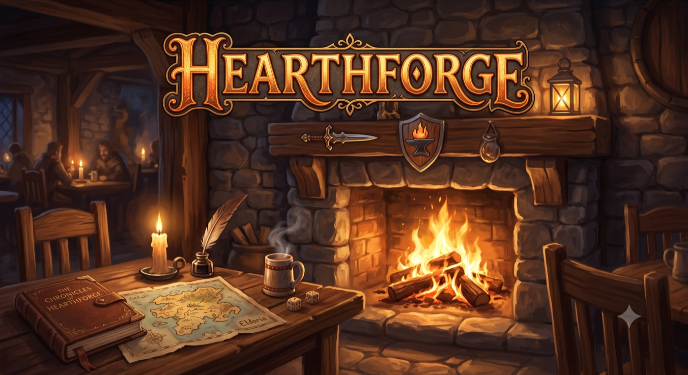

<p align="center">
  
</p>

# Hearthforge

A solo D&D 5e campaign by the fire: Claude tells the story, a local rules
engine rolls the dice.

Hearthforge is engine-first. The `dm-engine` is the complete mechanical
game — rules lookup (2014 rules / SRD 5.1), audited dice, and persistent
campaign state — exposed as an MCP server. Claude is the narrative brain
on top: it never computes or invents mechanical facts, only issues
commands and narrates the results. Play happens inside
[Claude Code](https://claude.com/claude-code), driven by the `dm-session`
skill.

**Local-first, solo by design.** Apart from Claude Code itself, everything
runs and stays on your machine: campaigns, characters, dice audit logs, and
the rules database are SQLite files in this directory, and nothing is sent
to any external API. The MCP server is a local subprocess Claude Code talks
to over stdio — it never reaches out to an external service. (The only
other network use is optional: `scripts/sync_srd.py`, if you choose to
re-fetch the vendored SRD data from GitHub.)

## Quickstart

You need [uv](https://docs.astral.sh/uv/) and
[Claude Code](https://claude.com/claude-code).

```
git clone https://github.com/tvashtar/hearthforge.git
cd hearthforge
uv sync
claude
```

Then just say **"start a campaign"**. (The rules database builds itself
from the vendored SRD data on first launch.) Claude interviews you for tone,
character concept, companions, and death mode, then builds your starting
world and the adventure begins. Next time, "continue my campaign" picks up
from the recap.

## Playing

- You roll your own character's dice and report the raw totals; the engine
  rolls everything else and records every die in an audit log.
- Keep your character sheet open in an editor —
  `campaigns/<slug>/sheets/<you>.md` live-updates as you play.
- No permission prompts: `.mcp.json` wires up the engine and the committed
  project settings preapprove the gameplay tools.

## Playtest feedback

After a session, ask Claude to "run a retro on this session" (the
`dm-retro` skill): it mines the session's audit log and transcript for
engine bugs, crashes, and friction, and produces an evidence-backed
findings report — send that along with your impressions.

## How it works

`ARCHITECTURE.md` describes the layering and the frozen engine contracts;
`docs/SCHEMA.md` documents both databases (campaign store + rules DB).

## Debug surface

The engine ships a CLI (`uv run dm --help`) for inspecting state outside of
a live session:

- `dm cmd` — execute one registry command against a campaign and print its
  result.
- `dm audit` — print every `dm_ruling` event: id, timestamp, rationale, and
  digest.
- `dm sheet <character> --campaign <slug>` — print a character's rendered
  markdown sheet (read-only, no snapshot).
- `dm lookup` — query the seeded SRD rules database (`rule`, `monster`,
  `spell` subcommands).
- `dm new` — create a new campaign with a minimal skeleton.
- `dm resume` — open a campaign (snapshotting it) and print the session
  brief.

## Attribution

Rules content is derived from the [SRD 5.1](data/srd/ATTRIBUTION.md),
licensed under CC-BY-4.0.
